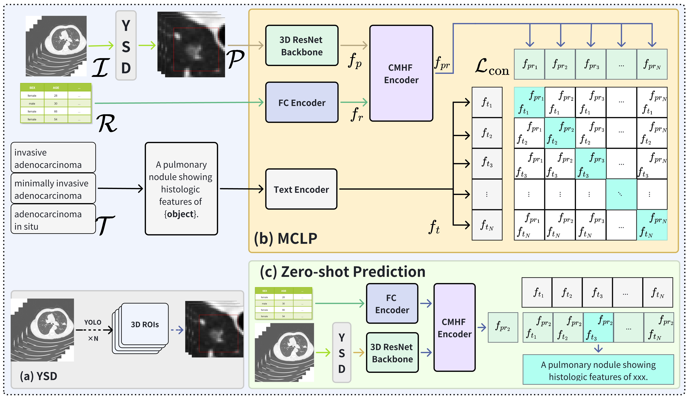

# Clinical Prior Guided Cross-Modal Hierarchical Fusion for Accurate Lung Cancer Diagnosis in CT Scans
## Ours framework

## Abstract
Accurate localization and classification of lung cancer in CT images are crucial for effective clinical treatment. However, existing approaches still face challenges such as redundant information in CT images, ineffective integration of clinical prior knowledge, and the difficulty in distinguishing subtle histological differences across lung cancer subtypes. To address these and enhance classification accuracy, we propose CM-DAC framework.
It adopts a YOLO-based slice detection module to detect and crop lesion areas into fixed sizes, which are then used as input for the Multimodal Contrast Learnning Pretrain (MCLP) module, reducing redundant information interference. 
In MCLP, 3D patches are aligned with clinical records through our Cross-modal Hierarchical Fusion module. This module uses an attention mechanism and residual connections to efficiently integrate image and clinical prior features. To capture subtle histological differences, we employ multi-scale fusion strategies by processing features at different resolutions, enabling the network to pay closer attention to features at all scales.
Simultaneously, a text path employs a medical ontology-driven text augmentation approach to expand category labels into semantic vectors describing morphological features. These vectors are encoded and aligns with fusion feature vectors.
Our CM-DAC outperforms several competitive methods, demonstrating exceptional classification performance.

# Datasets
**Private Dataset.** The dataset was collected from our collaborating hospital,
and consists of 1,614 cases of lung adenocarcinoma from 1,430 anonymous patients. Each case includes CT scan images, clinical data, and bounding boxes indicating tumor locations. The dataset is categorized into three groups: invasive adenocarcinoma, microinvasive adenocarcinoma, and adenocarcinoma in situ, comprising 53.5\%, 24.1\%, and 22.4\% of the cases, respectively. The clinical data were obtained through various pathological tests and were carefully evaluated by experienced medical professionals. This data includes demographic details such as patient age and gender, along with lesion-specific morphological characteristics, including tumor margin, density, shape, and location.

[**The open-source LPCD dataset**](https://doi.org/10.7937/TCIA.2020.NNC2-0461), includes the same modalities as our dataset. It comprises 342 lung cancer cases, categorized into adenocarcinoma, small cell carcinoma, large cell carcinoma, and squamous cell carcinoma. Due to the limited number of squamous cell cases, the large cell and squamous cell categories are combined, creating a three-class dataset. The class distributions are 70.7\% adenocarcinoma, 17.3\% small cell carcinoma, and 12.0\% for the merged large and squamous cell carcinoma category.
# Experiment Results


# Codes
## For trainning
### det model
```bash
python ./model/yolo/v11.py
```

### cls model
```bash
python train_cls.py --root /path/your/datasets
```

## Inference
```bash
python train_cls.py --root /path/your/datasets --phase val
```

